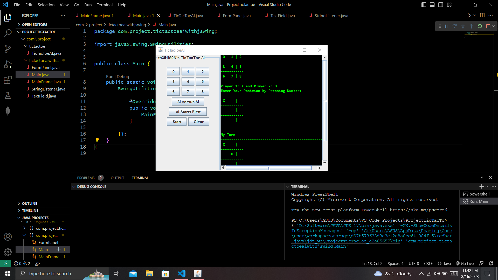
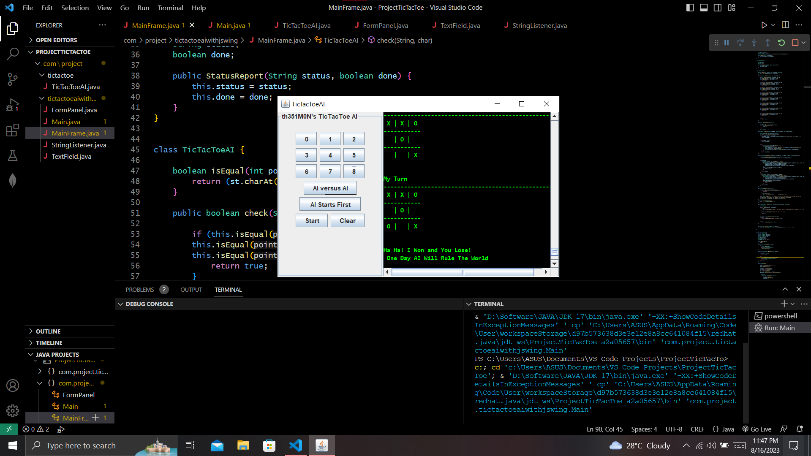
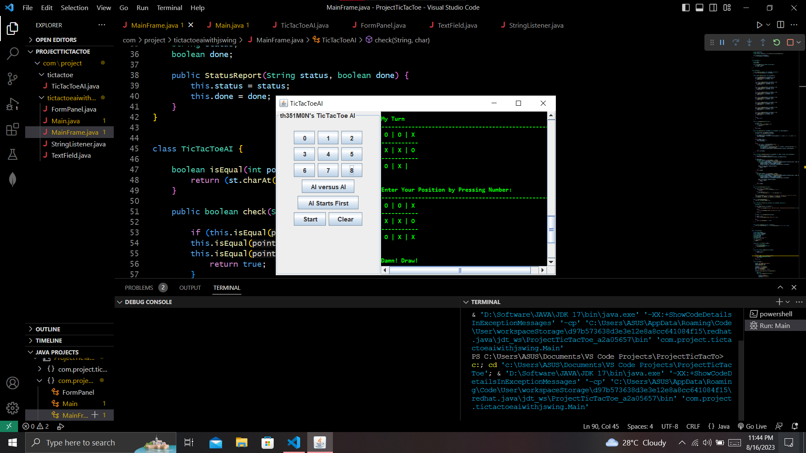

# TicTacToe-AI-Project-using-Tree-and-Alpha-Beta-Pruning-Algorithm-and-Swing-Library

# Human X Vs Artificial Intelligence O 
**Start** button starts the program where **Human** does the first move and this second moveset is picked by the **Artificial Intelligence** itself.

_Program Starts_

**Artificial Intelligence Winning** situation.

_Artificial Intelligence Wins_

The result is **Draw**

_Result is Draw_

