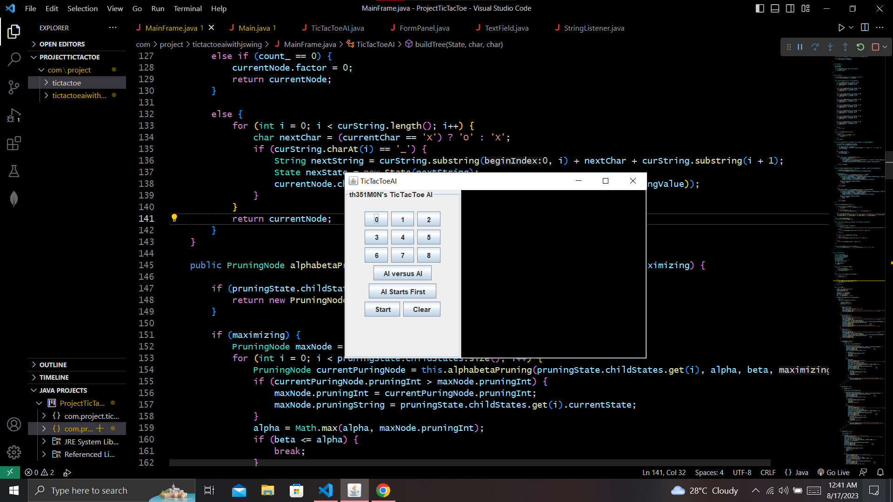

# TicTacToe-AI-Project-using-Tree-and-Alpha-Beta-Pruning-Algorithm-and-Swing-Library

The **Tic-Tac-Toe Artificial Intelligence** Project has been programmed using Java Programming Language. The AI is **Unbeatable**. It will either draw or win the game. **Tree Data Structure** and **Alpha Beta Pruning Algorithm** have been used in this project. The Tree Data Structure creates different future states of the current state. Each state carries a **Utility Function**. This utility Function values are needed for the leaf nodes when Alpha Beta Pruning Algorithm is applied on that tree. Utility function For Maximizing Level Nodes = 1 * (number of empty cells + 1) and For Minimizing Level Nodes = -1 * (number of empty cells + 1). The Alpha Beta Pruning Algorithm determines the best counter state of the current state. Java's **Swing** library has been used to create the **Graphical User Interface (GUI)**. 

_The Project_

# Human X Vs Artificial Intelligence O 
**Start** button starts the program where **Human** does the first move and this second moveset is picked by the **Artificial Intelligence** itself.

_Program Starts_

**Artificial Intelligence Winning** situation.

_Artificial Intelligence Wins_

The result is **Draw**.

_Result is Draw_

# Artificial Intelligence X Vs Human O
**AI Starts First** does the opposite of above operation. Here **My Turn** indicates AI is picking moveset.

_AI Pickes His Move At First_

**Draw** result.

_Result is Draw_

**Artificial Intelligence** does my tricky moves.

_Tricky Move 1_

_Tricky Move 2_

# Artificial Intelligence 1 X Vs Artificial Intelligence 2 O
**AI versus AI** button does the action where two AIs battle against each other.

_First Move_

_Second Move_

_Third Move_

